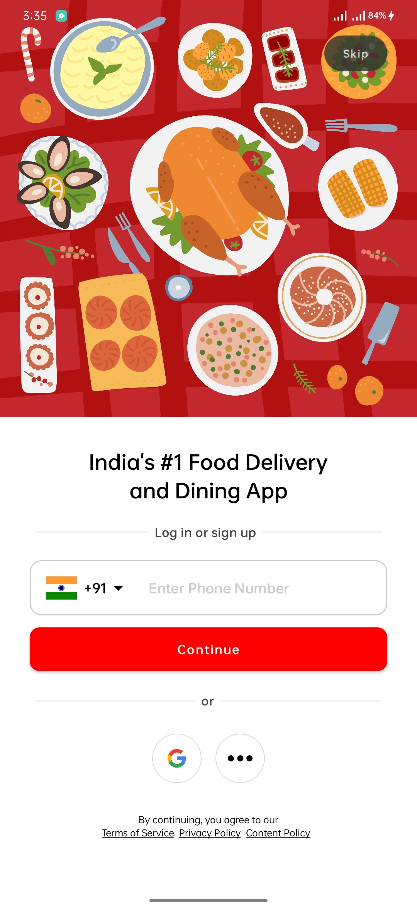
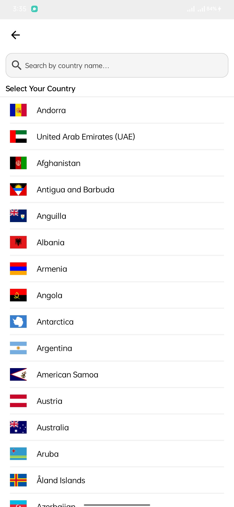
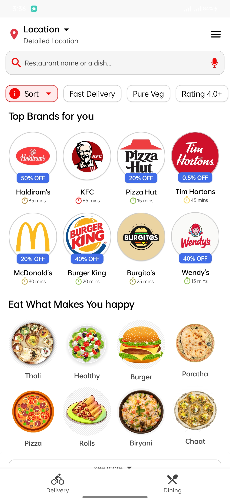
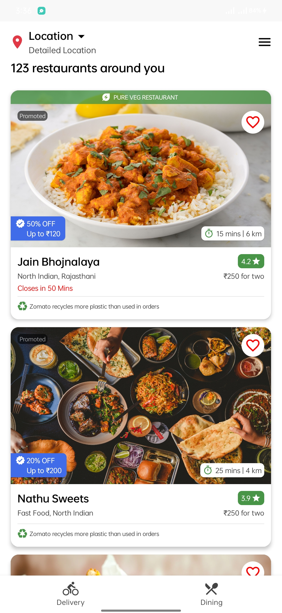
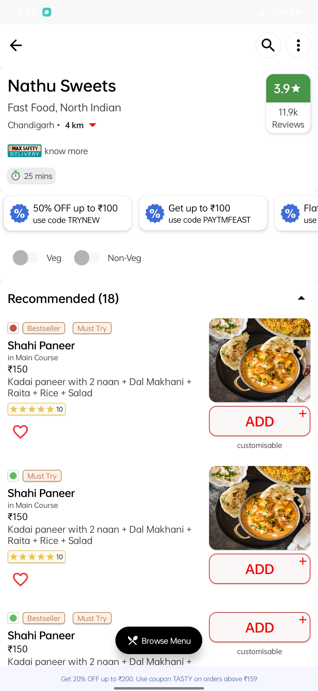
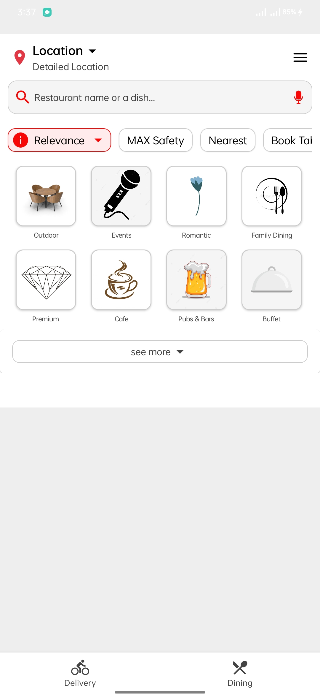

# Zomato-Clone

A clone of Zomato, A Online Food Ordering App using Jetpack Compose Below are a few Screenshots of
the app till now ->

    

 

    
    

### Screens

Demo             |  Login Screen | Country Picker Screen
:-------------------------:|:-------------------------: | :-------------------------: 
  |   | 

Home Screen            |  Restaurant Card | Restaurant Details
:-------------------------:|:-------------------------: | :-------------------------: 
  |   | 

Dining Screen            
:-------------------------:
 

### Status: 🚧 In progress

Zomato-Clone is still under development and more screens will be added soon.

### Libraries used

* [Jetpack Compose]
* [Accompanist]
* [Compose Destinations]
